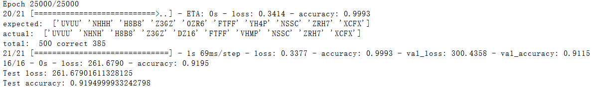

# SCNU-SSO-CAPTCHA

> scnu sso captcha filler using tensorflow

# Project structure

```plain
├── Dockerfile
├── image.ipynb
├── output // output dir
├── package.json
├── package-lock.json
├── README.md
├── requirements.txt
├── saved-model // tensorflow python savedModel
├── src // source code
    ├── config
    ├── convert.py
    ├── dataset
        ├── codes
        │   ├── mark // marked image
                     // .jpg 是自动生成的验证码, .jpeg 是无视大小写的sso验证码
                     // 没后缀的是大小写敏感的sso验证码
        │   └── raw  // 原图
        ├── __init__.py
    ├── fetch.js // 抓取验证码到 dataset/raw
    ├── index.html
    ├── model
    ├── predict.py
    ├── predict-web.py // model 预测 Web API
    ├── __pycache__
    ├── test-existed-model.py
    ├── train.py
    └── web.js // 3000 端口输入
├── test
└── web-model // saved tensorflow.js model
```

## 模型

## Heavy
`saved-model/model-heavy.tar.gz`



## Lite
`saved-model/mode-lite.tar.gz`

