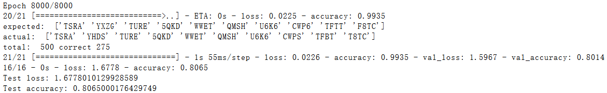

# SCNU-SSO-CAPTCHA

> scnu sso captcha filler using tensorflow      
> User Script: https://greasyfork.org/zh-CN/scripts/417693-scnu-sso-auto-captcha-filler

# Project structure

```plain
├── Dockerfile
├── image.ipynb
├── output // output dir
├── package.json
├── package-lock.json
├── README.md
├── requirements.txt
├── saved-model // tensorflow python savedModel
├── src // source code
    ├── config
    ├── convert.py
    ├── dataset
        ├── codes
        │   ├── mark // marked image
                     // .jpg 是自动生成的验证码, .jpeg 是无视大小写的sso验证码
                     // 没后缀的是大小写敏感的sso验证码
        │   └── raw  // 原图
        ├── __init__.py
    ├── fetch.js // 抓取验证码到 dataset/raw
    ├── index.html
    ├── model
    ├── predict.py
    ├── predict-web.py // model 预测 Web API
    ├── __pycache__
    ├── test-existed-model.py
    ├── train.py
    └── web.js // 3000 端口,验证码手动输入
├── test
└── web-model // saved tensorflow.js model
```

## 模型
`src/model` 中的模型如下
```plain
Model: "captcha_model"
_________________________________________________________________
Layer (type)                 Output Shape              Param #
=================================================================
input_1 (InputLayer)         [(None, 50, 100, 1)]      0
_________________________________________________________________
conv2d (Conv2D)              (None, 48, 98, 16)        160
_________________________________________________________________
conv2d_1 (Conv2D)            (None, 48, 98, 16)        2320
_________________________________________________________________
p_re_lu (PReLU)              (None, 48, 98, 16)        75264
_________________________________________________________________
conv2d_2 (Conv2D)            (None, 46, 96, 32)        4640
_________________________________________________________________
conv2d_3 (Conv2D)            (None, 46, 96, 32)        9248
_________________________________________________________________
p_re_lu_1 (PReLU)            (None, 46, 96, 32)        141312
_________________________________________________________________
max_pooling2d (MaxPooling2D) (None, 15, 32, 32)        0
_________________________________________________________________
dropout (Dropout)            (None, 15, 32, 32)        0
_________________________________________________________________
conv2d_4 (Conv2D)            (None, 13, 30, 64)        18496
_________________________________________________________________
conv2d_5 (Conv2D)            (None, 13, 30, 64)        36928
_________________________________________________________________
re_lu (ReLU)                 (None, 13, 30, 64)        0
_________________________________________________________________
conv2d_6 (Conv2D)            (None, 11, 28, 128)       73856
_________________________________________________________________
conv2d_7 (Conv2D)            (None, 11, 28, 128)       147584
_________________________________________________________________
re_lu_1 (ReLU)               (None, 11, 28, 128)       0
_________________________________________________________________
max_pooling2d_1 (MaxPooling2 (None, 3, 9, 128)         0
_________________________________________________________________
flatten (Flatten)            (None, 3456)              0
_________________________________________________________________
dropout_1 (Dropout)          (None, 3456)              0
_________________________________________________________________
dense (Dense)                (None, 144)               497808
_________________________________________________________________
reshape (Reshape)            (None, 4, 36)             0
_________________________________________________________________
softmax (Softmax)            (None, 4, 36)             0
=================================================================
```
~~因为 Firefox 在运行该模型耗时较长约是 Chromium 中的 3~4 倍。所以在去除几层神经网络之后重新训练的Lite版模型可以将 Firefox 上的耗时控制在一个比较合理的水平。在 user script 中会根据 `navigator.userAgent` 来选用模型。Lite版模型准确率从 0.919 最多下降到 0.806。 lite-1 版模型精简程度较少，准确率更高。算是一个比较好的平衡，将会用在 Firefox 的油猴脚本中。~~

v2 update: Lite 模型会用在移动设备（目前只有Firefox Android Nightly版能安Violentmonkey）


## Heavy
`saved-model/model-heavy.tar.gz`


## Lite
`saved-model/mode-lite.tar.gz`



# 免责声明
- 该脚本仅为Web前端的深度学习和图像处理学习测试使用。请勿将该脚本用于正常登录中或者任何不符合学校校规校纪和相关法律法规的场合！如有因此造成的各种后果，本人概不负责！
- 允许二次开发和直接转载，但应当注明出处，本人不对二次开发后脚本的各种问题负责！
